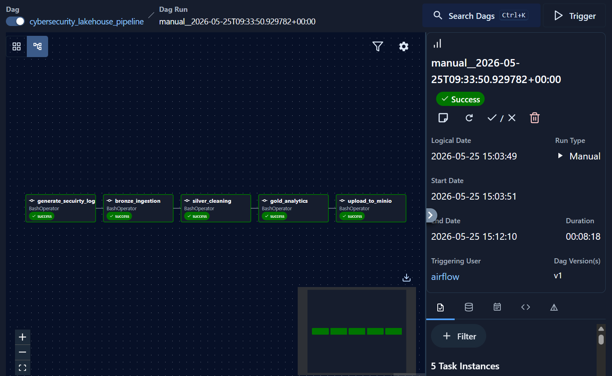
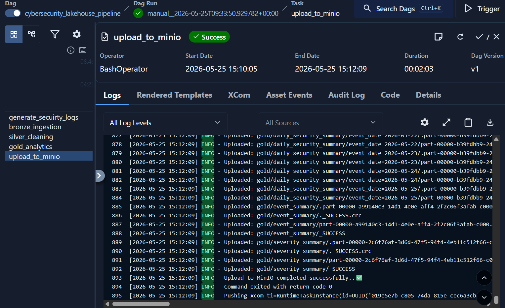
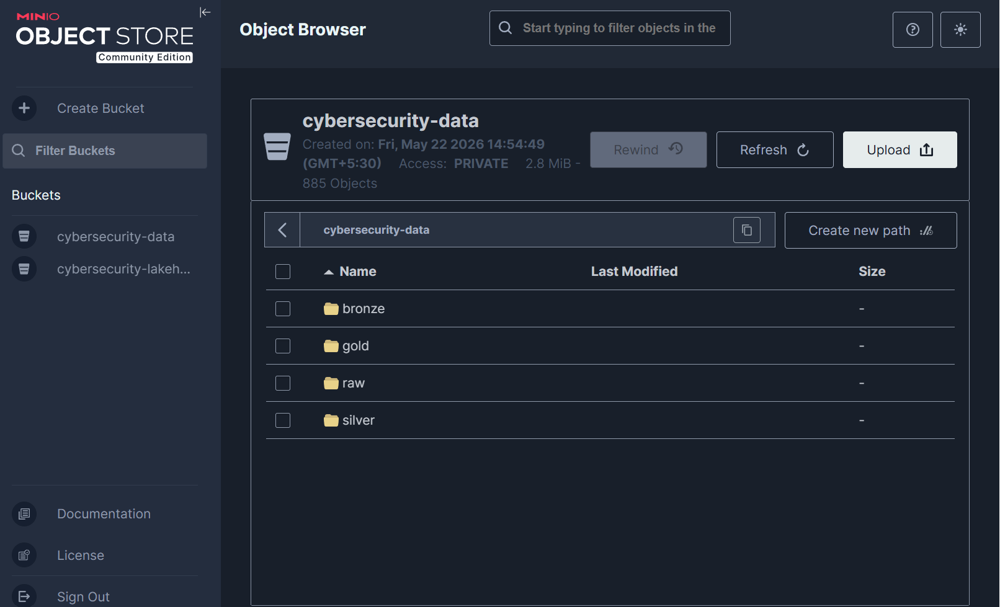
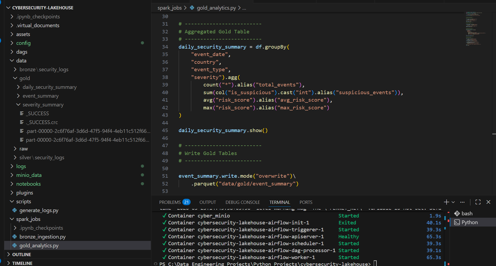

# Cybersecurity Lakehouse Pipeline

A production-style data engineering project that processes cybersecurity event logs using PySpark, Airflow, MinIO, Docker, and Parquet.

## Project Overview

This project simulates a modern cybersecurity analytics lakehouse pipeline. It ingests raw security event logs, processes them through Bronze, Silver, and Gold layers, and stores analytics-ready parquet outputs in MinIO object storage.

The pipeline is orchestrated using Apache Airflow and follows modern data engineering practices such as medallion architecture, object storage, modular Spark jobs, and production-style folder structure.

## Tech Stack

- Python
- PySpark
- Apache Airflow
- Docker
- MinIO
- Parquet
- Pandas
- PostgreSQL

## Architecture

```text
Security Logs
↓
Bronze Layer
↓
Silver Layer
↓
Gold Layer
↓
MinIO Object Storage
↓
Analytics Outputs
````

## Medallion Architecture

### Bronze Layer
Raw security logs are ingested and stored as parquet files.

### Silver Layer
Data is cleaned by removing duplicates, handling nulls, and standardizing records.

### Gold Layer
Analytics-ready datasets are created, including:
- threat event summary
- severity summary
- daily security summary

## Project Structure

```text
cybersecurity-lakehouse/
├── dags/
│   └── cybersecurity_lakehouse_dag.py
├── data/
│   ├── raw/
│   ├── bronze/
│   ├── silver/
│   └── gold/
├── spark_jobs/
│   ├── bronze_ingestion.py
│   ├── silver_cleaning.py
│   └── gold_analytics.py
|   └── upload_to_minio.py
├── scripts/
|   └── generate_security_logs.py
├── logs/
├── docker-compose.yaml
├── requirements.txt
└── README.md

## Screenshots





